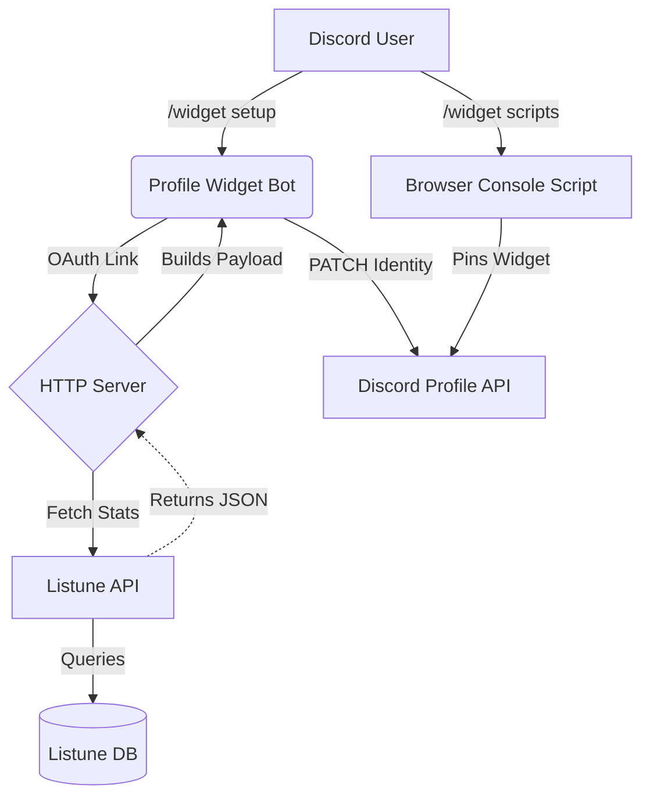

<div align="center">
  
  
  <strong>
    <p>Showcase Your Music Taste, Right on Your Profile.</p>
    <p>The official Listune Discord Profile Widget. Display your real-time music statistics directly on your Discord profile card.</p>
  </strong>

  <h3 align="center">
    <a href="https://listune.app/invite">
      
    </a>
    <a href="https://listune.app/support">
      
    </a>
    <a href="https://listune.app">
      
    </a>
  </h3>
</div>

---

## Overview

This project is a custom Discord profile widget integration specifically built for **Listune**. It essentially "hijacks" Discord's native User Application Profile (gaming) widget system to display beautiful Listune music statistics directly on a user's Discord profile card.

## Preview

<div align="center">
  
</div>

## Features

- **Discord Slash Commands:** Fully integrated slash commands for setup, refresh, status checks, and custom images (`/widget setup`, `/widget refresh`, `/widget status`, `/widget image`, `/widget scripts`).
- **Listune API Integration:** Safely fetches real-time music statistics from the main Listune API.
- **Dynamic Widget Payload Builder:** Maps Listune data (e.g., Top Track, Liked Songs) into Discord's expected gaming widget schema (`rank_name`, `total_games`, etc.).
- **Rich Display Data:** Shows the user's Display Name, Username, Custom/Discord Avatar, Top Track, Top Artist, Tracks Played, Listen Time, Liked Songs, and Top.gg Vote status.
- **Lightweight JSON Storage:** Uses a local JSON file to securely store Discord OAuth tokens and refresh metadata without needing a heavy SQL database.
- **Unified Startup:** Runs both the Discord bot client and the Express/HTTP web server on a single Node.js process using a combined command.
- **Health Endpoint:** Exposes HTTP endpoints for OAuth callbacks and health monitoring.

## How It Works

The entire flow bridges the gap between Discord's rigid UI and Listune's dynamic data:

1. **User runs `/widget setup`:** The bot responds with an OAuth Link Account button.
2. **Account Linking:** The user authorizes the application, and the internal HTTP server captures the Discord OAuth token.
3. **Data Fetching:** The project calls the Listune API to retrieve the user's music stats.
4. **Payload Normalization:** The stats are mapped into Discord's specific JSON schema structure.
5. **Widget Generation:** The bot patches the user's Application Profile identity on Discord.
6. **Script Execution:** The user runs `/widget scripts`, copies the provided JavaScript snippet, and pastes it into their Discord browser console to officially "pin" the widget to their profile layout.
7. **Subsequent Refreshes:** The user can run `/widget refresh` anytime to pull fresh data from the Listune API and update their profile card.



## Project Structure

- `src/index.ts`: The unified entry point. Initializes storage, starts the HTTP server, and starts the Discord bot.
- `src/api/server.ts`: The Express HTTP server handling the Discord OAuth callback and token refreshing.
- `src/bot/index.ts`: The Discord client setup and slash command registrar.
- `src/bot/commands/widget.ts`: The core slash command handlers (`setup`, `refresh`, `scripts`, `image`, `status`) and the payload builder logic.
- `src/config/script.js`: The raw JavaScript snippet that users must paste into their browser console to pin the widget.
- `src/config/widget-layout.ts`: Constants mapping Listune fields to Discord's internal gaming widget fields.
- `src/database/store.ts`: Read/write handlers for the local `widget-store.json` file.
- `src/services/discord.service.ts`: Handles Discord OAuth token exchanges and Application Profile patching.
- `src/services/listune.service.ts`: Handles fetching and normalizing user stats from the Listune API.
- `data/widget-store.json`: The persistent JSON database (created automatically).

## Data Source

This widget **does not query the main database directly**. 
It strictly acts as a consumer of the Listune API.

- The URL is defined via `LISTUNE_API_BASE_URL`.
- It authenticates with the Listune API using the `LISTUNE_API_SECRET`.
- If the user is missing stats, the service automatically implements safe fallbacks (e.g., `"No data yet"` or `0`) to prevent the widget from crashing or displaying undefined values.

## Displayed Widget Data

The widget maps standard music stats into Discord's profile schema.
- **Display Name** & **Username**: Fetched from the Listune API.
- **User Avatar**: Uses a custom image set via `/widget image`, the user's Discord avatar, or a fallback Listune logo.
- **Top Track**: Only displays the #1 most played track.
- **Top Artist**: Only displays the #1 most played artist.
- **Tracks Played**: Total cumulative scrobbles.
- **Listen Time**: Displayed in rounded hours.
- **Liked Songs**: Total songs saved by the user.
- **Member Since**: Date of joining Listune.

## Environment Variables

Copy `.env.example` to `.env` and fill in the required credentials.

| Variable | Required | Description |
| -------- | -------- | ----------- |
| `DISCORD_TOKEN` | Yes | The bot token from the Discord Developer Portal. |
| `DISCORD_CLIENT_ID` | Yes | The application Client ID. |
| `DISCORD_CLIENT_SECRET` | Yes | The application Client Secret (for OAuth). |
| `DISCORD_REDIRECT_URI` | Yes | OAuth callback (e.g., `http://localhost:3000/oauth/discord/callback`). |
| `DISCORD_API_BASE_URL` | Yes | Discord API URL (usually `https://discord.com/api/v10`). |
| `LISTUNE_API_BASE_URL` | Yes | Base URL of the deployed Listune API. |
| `LISTUNE_API_SECRET` | Yes | Must match `ADMIN_SECRET` in the Listune API project. |
| `WIDGET_BOT_AVATAR_URL` | No | Fallback avatar image URL. |
| `JSON_DB_PATH` | No | Path to the JSON database (defaults to `./data/widget-store.json`). |
| `PORT` | Yes | Port for the HTTP server (e.g., `3000`). |
| `AUTO_REFRESH_DAILY` | No | Set to `true` to auto-refresh all linked users every 24h. |

## Installation

This project utilizes Node.js and standard NPM packages.
```bash
npm install
```

## Running Locally

1. Create a `.env` file based on `.env.example`.
2. Fill in your Discord Developer credentials and the Listune API secret.
3. Start the unified process (compiles TypeScript on the fly in dev mode):
```bash
npm run dev
```
*(This command will simultaneously spin up the HTTP web server on your designated `PORT` and log in the Discord bot).*

## Available Scripts

Defined in `package.json`:

- `npm run start`: Runs the compiled JavaScript from `dist/index.js`.
- `npm run dev`: Runs the full project in development mode with hot-reloading (`tsx watch`).
- `npm run dev:server`: Runs only the HTTP server in development mode.
- `npm run dev:bot`: Runs only the Discord bot in development mode.
- `npm run start:prod`: Compiles the TypeScript project and starts it (`npm run build && npm run start`).
- `npm run build`: Compiles the TypeScript source into the `dist/` folder using `tsc`.
- `npm run typecheck`: Validates TypeScript typings without emitting files.

## Discord Commands

The bot registers the following `/widget` slash subcommands:

- `/widget setup`
  - **Purpose:** Initiates the account linking process.
  - **Result:** Provides a button containing the personalized Discord OAuth URL.
- `/widget scripts`
  - **Purpose:** Retrieves the manual installation script.
  - **Result:** Provides a safe JavaScript snippet for the user's browser console.
- `/widget refresh`
  - **Purpose:** Manually forces an update of the user's profile widget.
  - **Result:** Pulls fresh data from the Listune API and pushes it to Discord.
- `/widget status`
  - **Purpose:** Checks the current linking status and last refresh timestamp.
  - **Result:** Displays an embed with connection health.
- `/widget image`
  - **Options:** `url` (String, Required)
  - **Purpose:** Overrides the default avatar image displayed on the widget.
  - **Result:** Saves the custom image URL and triggers an immediate refresh.

> [!CAUTION]
> This script is intentionally designed to run *locally*. It does not transmit the user's token to our servers. However, because it relies on internal Discord Webpack structures, it is susceptible to breaking if Discord updates their web client architecture.

## API Integration

The project communicates strictly with the external Listune API to retrieve user statistics.

- **Base URL:** `LISTUNE_API_BASE_URL`
- **Authentication:** Requires `Authorization: Bearer <LISTUNE_API_SECRET>`
- **Endpoints Used:** 
  - `GET /v1/widget/users/:discordId` (Compact stats)
  - `GET /v1/users/:discordId/stats` (Full detailed stats)

**Example Expected Response:**
```json
{
  "success": true,
  "data": {
    "userId": "123456789",
    "displayName": "Music Lover",
    "username": "musiclover99",
    "tracksPlayed": 14500,
    "listenTime": "450h 30m",
    "likedSongs": 120,
    "topTracks": [{ "name": "Blinding Lights" }],
    "topArtists": [{ "name": "The Weeknd" }]
  }
}
```